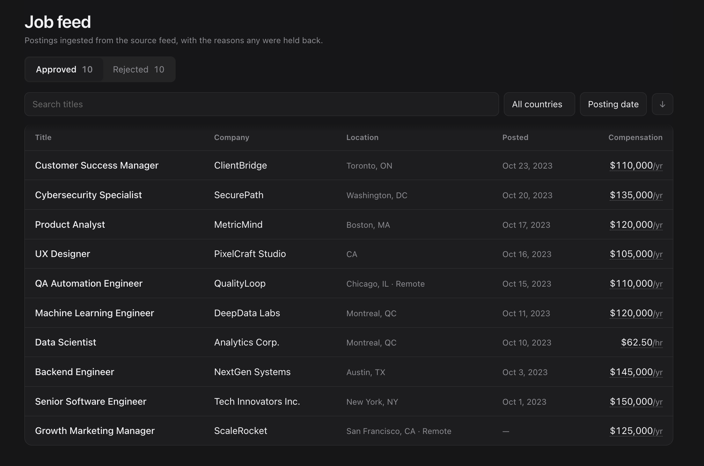
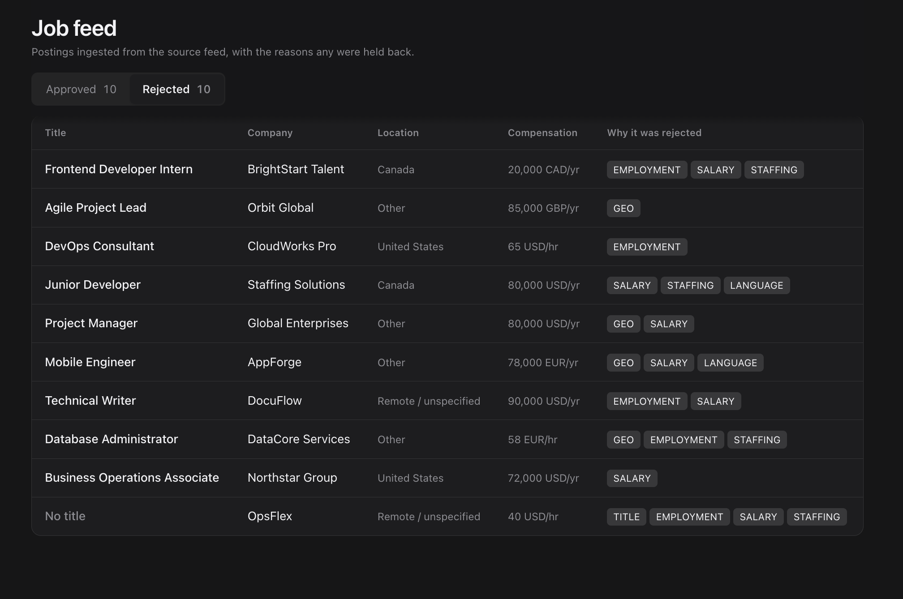

# Job Ingestion and Search System

Ingests job postings from heterogeneous JSON feeds, normalizes them into a
common internal representation, evaluates them against publication criteria,
and exposes the approved set through a searchable UI.

Rejected postings are not discarded: they are logged with structured rejection
reasons and surfaced in the UI alongside approved ones, because the reasons a
feed fails are the most useful artifact when diagnosing feed quality.

## Stack

| Layer | Choice | Why |
| --- | --- | --- |
| Backend | Python 3.12, FastAPI, Pydantic v2 | Typed models with runtime validation at the ingestion boundary |
| Frontend | React 19, TypeScript, Vite | Required by the brief; Vite for fast iteration |
| Tooling | uv, ruff, mypy (strict), eslint, pytest, vitest | Type checking enforced from the first commit, not retrofitted |
| Runtime | Docker Compose | One command to run the whole system |

## Quick start

```bash
make up
```

- API: http://localhost:8000
- API docs: http://localhost:8000/docs
- UI: http://localhost:5173

Stop with `make down`.

The feed is read from `data/jobs.json`, mounted read-only into the backend
container. The path is configurable via the `JOBS_FEED_PATH` environment
variable.





## Commands

| Command | What it does |
| --- | --- |
| `make up` | Development stack at http://localhost:5173 |
| `make down` | Stop the development stack |
| `make up-prod` | Production stack at http://localhost:8080 |
| `make down-prod` | Stop the production stack |
| `make test` | pytest and vitest |
| `make lint` | ruff, mypy strict, eslint, tsc |
| `make format` | ruff format |

## Local development without Docker

Backend:

```bash
cd backend
uv sync
uv run uvicorn jobs.api.main:app --reload
```

`uv` provisions Python 3.12 itself — no system Python version is required or
modified.

Frontend:

```bash
cd frontend
npm install
npm run dev
```

The dev server proxies `/api` to the backend, so the frontend never holds a
backend URL. No CORS configuration is needed in either environment.

## API

| Endpoint | Description |
| --- | --- |
| `GET /jobs` | Approved postings. Query parameters: `search` (case-insensitive title match), `country`, `sort_by` (`salary`, `posting_date`), `order` (`asc`, `desc`) |
| `GET /jobs/rejected` | Rejected postings with their rejection reasons |
| `GET /countries` | Countries present in approved postings, derived from the data rather than hard-coded |
| `GET /health` | Liveness check |

Interactive documentation is available at `/docs` while the API is running.

Postings sort by a comparable annual figure in USD, so a list mixing annual
salaries with hourly rates orders sensibly. Postings with no value for the sort
field — an undated posting, for instance — always sort last, in both
directions.

An unrecognized `country` value returns 422 rather than an empty list, so a
client can tell a typo from a genuine absence of matches. An empty value means
no filter.

## Rejection log

Every rejected posting is written to the `jobs.rejections` logger as a single
structured JSON line carrying the posting's index, title, company and the full
list of rejection reasons. The log is the machine-readable record and works
with no UI running; the rejected tab in the interface reads the same data.

Startup logs one line per rejected posting with its reasons, followed by a
one-line ingestion summary with the counts, so a reviewer running `make up`
sees both immediately.

## Testing

```bash
make test
make lint
```

Backend tests are organized per architectural layer: adapters, normalization,
each approval rule, the rule engine, storage, and API. A single parametrized
acceptance test runs the full sample feed against a hand-derived expectations
table in `backend/tests/fixtures/expected_decisions.py`.

That table was written before the implementation, from the criteria in the
brief, and is not generated from running code. When implementation and table
disagree, the first question is which of the two is wrong.

The brief asks to confirm that "both feeds do parse correctly". The sample data
is a single file containing records in two different shapes, so this is read as
two feed formats rather than two files. Both shapes are covered by
`test_adapters.py`, which asserts that an equivalent posting produces the same
`RawJob` whichever shape it arrived in, excluding the currency field that the
flat feed does not carry at all.

`backend/tests/test_future_rule.py` demonstrates extensibility directly: it adds
a market for remote UK postings at a 90,000 USD threshold — the brief's own
forward-looking example — and asserts that a previously rejected posting is
approved. Adding it touches configuration only; no rule, engine or pipeline code
changes.

## Project structure

```
backend/src/jobs/
├── models/          # RawJob, CanonicalJob, Decision, enums
├── ingestion/       # feed loading and pipeline
│   └── adapters/    # one adapter per feed shape
├── normalization/   # location, salary, currency conversion
├── approval/        # market policy and rule engine
│   └── rules/       # one file per approval criterion
├── storage/         # job repository, rejection log
├── api/             # FastAPI application and response schemas
│   └── routes/      # HTTP routes
└── config/          # markets, thresholds, parsing assumptions, settings

frontend/src/
├── api/             # typed API client
├── components/      # table, filters, tabs
├── hooks/           # data fetching and query state
├── lib/             # formatting helpers
├── test/            # vitest setup
└── types/           # shared types

data/jobs.json       # sample feed (committed — the system needs it to run)
```

All parsing assumptions — the hourly-inference ceiling, the default currency,
country aliases, exchange rates — live in `config/`, not scattered through the
parsers, so that every guess the system makes about ambiguous data can be read
in one place.

## Docker: development vs production

Both configurations ship. `make up` runs development images — source mounted as
volumes, Uvicorn with `--reload`, Vite in dev mode — which is what makes the
system inspectable while working on it. `make up-prod` runs production images:
the frontend is a static bundle served by nginx, the backend runs without
`--reload` and without dev dependencies, and both copy their source in at build
time rather than mounting it.

| | `make up` | `make up-prod` |
| --- | --- | --- |
| Frontend | Vite dev server, port 5173 | Static bundle behind nginx, port 8080 |
| Backend | `--reload`, port 8000 exposed | Two workers, reachable only through nginx |
| Source | Bind-mounted for hot reload | Copied into the image |
| Dependencies | Includes pytest, mypy, ruff | Runtime only |

What is still mocked, and would not be in production:

- **Feed ingestion** runs at application startup against a local file. In
  production this would be a scheduled or event-driven job writing to a
  persistent store, decoupled from the API process lifecycle.
- **Storage** is an in-memory implementation behind a protocol. Swapping in a
  database implementation requires no changes to the pipeline, the rules, or
  the API layer.
- **Exchange rates** are static values behind a converter protocol rather than
  a rate service.

The brief permits mocked infrastructure and asks for production-ready
*structure and design*. The seams where real infrastructure would attach are
protocols, not concrete classes.

## Design notes

`DECISIONS.md` records the interpretation choices made while implementing the
approval criteria, each with the alternative that was rejected — including how
remote postings outside the US and Canada are treated, how salaries with
missing units or currencies are resolved, why hourly rates are not converted to
annual figures for threshold checks, where the system's tolerance for malformed
input deliberately stops, and which production properties are absent by design
rather than by oversight.